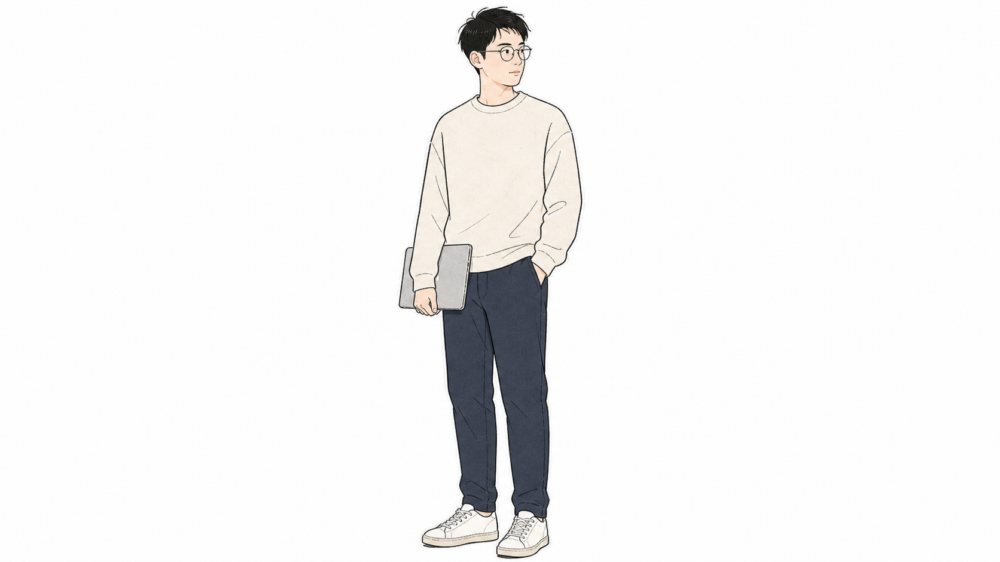
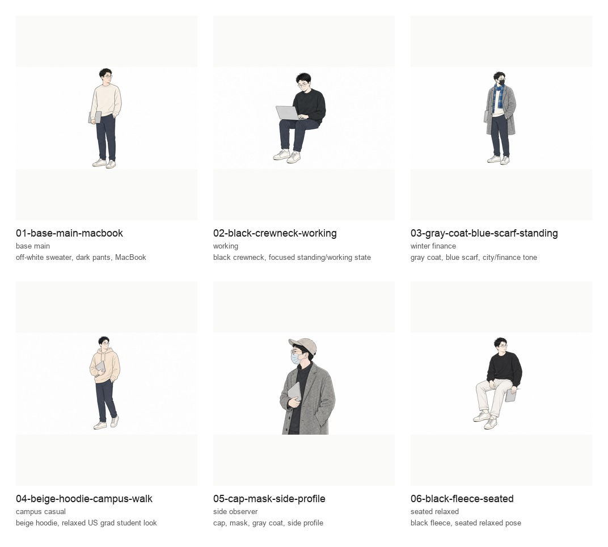
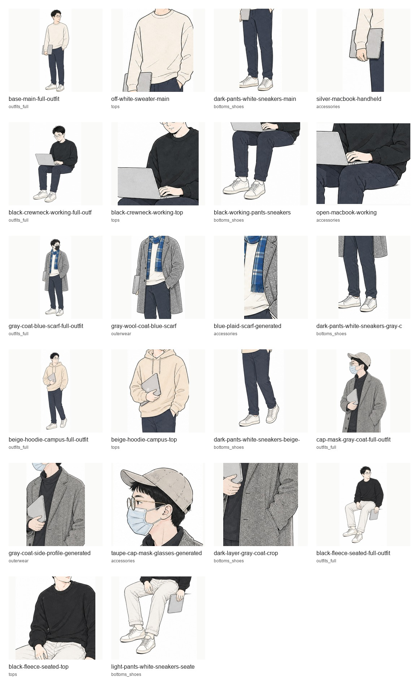

# Digital Me

一个用于创建个人形象 IP 的 **Codex 技能**。

当前版本：`v0.2.0`

把真人照片或简短描述，快速变成一个可持续复用的个人形象 IP。

目标不是做一张“一次性头像”，而是帮每个人沉淀一套自己的数字形象系统：主形象、身份锚点、提示词种子、常用状态变体，以及可继续扩展的衣服/道具/场景参考。

## 安装

通过 npm 使用 `npx` 安装到 Codex：

```bash
npx --yes @ethansmc/digital-me
```

安装器会把 `digital-me.skill` 解压到 `$CODEX_HOME/skills/digital-me`，如果没有设置 `CODEX_HOME`，默认使用 `~/.codex/skills/digital-me`。安装后重启 Codex 以加载技能。

如果本地已经安装过旧版本，可以覆盖安装：

```bash
npx --yes @ethansmc/digital-me -- --force
```

也可以直接从 GitHub release tag 安装：

```bash
npx --yes github:EthanSMC/digital-me#v0.2.0
```

## 创作背景

这个技能来自一次很具体的需求：我在使用 `ian-xiaohei-illustrations` 做中文正文配图时，很喜欢“小黑”这种稳定、可复用、能承载内容表达的视觉 IP。

但问题是，小黑是 Ian 的 IP。它适合文章里的结构、隐喻和观点表达，却不能替代我自己的个人形象。

所以我想做一个新的 Codex skill：让任何人都能从自己的照片出发，快速创建一个属于自己的 “Digital Me”。它不是要复制某个现成角色，而是把真人特征、穿搭气质、使用场景和个人品牌目标，沉淀成一套可以反复生成、持续迭代的个人形象系统。

## 核心定位

Digital Me 面向想拥有个人视觉资产的人：创作者、学生、独立开发者、咨询顾问、创业者、老师、内容作者、播客/视频作者，以及任何想把自己从“真人照片”延展成“可复用形象 IP”的人。

它适合用来做：

- 个人头像、社交媒体头像、播客/视频/课程形象
- 个人品牌角色、数字分身、内容配图角色
- 从真人照片中提取脸、发型、气质和穿搭锚点
- 生成主形象和 3-5 个常用状态变体
- 默认生成一张适合社交平台方形/圆形裁切的 social media 头像，并导出圆形透明版本
- 用已有主形象、cutout 或上一版不满意头像作为参考，继续迭代更贴近本人的头像
- 把成功图片沉淀成后续可复用的 prompt seed 和素材库
- 把已经稳定的 Digital Me 用到用户指定的内容实践里，例如短视频、教程、skill/产品讲解、文章配图、封面和课程/播客片头

默认是快速模式：先做出能用的主形象，再决定要不要进一步整理衣橱、manifest、contact sheet 和长期素材库。

## v0.2.0 新功能（2026-07-07）

- 新增 reference-driven 头像实践：可用已有主形象、cutout 或上一版头像反馈继续生成更稳定的个人 IP 头像。
- 默认交付 social media 方形头像，并导出透明圆形头像，适配小红书、个人主页和 skill/内容封面。
- 新增 `scripts/export_circle_avatar.py`，只负责圆形透明头像后处理；主角生成必须走图像生成模型。
- 新增视频实践：可把稳定的 Digital Me 资产用于短视频、教程、skill/产品讲解、课程/播客片头等内容。
- 强化案例边界和 anti-drift 规则，避免把 Digital Ethan 示例误当成新人设模板。
- 安装包 `digital-me.skill` 只包含运行所需文件，并通过测试防止 README、tests、pycache 等开发文件进入包内。

## 这个技能解决什么

很多人不是没有照片，而是缺少一套能持续复用的形象语言：

- 每次生成头像都像另一个人
- 没有稳定的发型、脸部、穿搭和气质锚点
- 做内容配图时只能借用别人的 IP 或通用卡通角色
- 想做个人品牌，但没有一套可延展的视觉资产
- 成功生成过一张图，但下一次不知道怎么复刻和扩展

Digital Me 把这个过程拆成一个可执行工作流：先识别身份锚点，再生成主形象，再扩展变体，最后把成功结果沉淀成下一轮可以继续使用的素材库。

## 案例边界：Digital Ethan

这是一个完整案例，用来展示这个 skill 能产出什么。案例不是模板，也不是默认人设；别人使用时，身份锚点必须来自他们自己的照片、职业气质、穿搭和使用场景。

### 主形象

从真实照片中提炼脸部、发型、表情、穿搭和气质锚点后，先生成一个稳定主形象。



### 变体组

主形象稳定后，再生成不同状态：工作、城市、校园、观察、日常等。重点是每张图都保持同一个人的识别度，而不是变成不同角色。



### 生成版衣橱

从成功生成图里再提取衣服、道具和造型，作为“这个 IP 画风里已经跑通”的参考。



## 工作流

### 1. 读照片或描述

先提炼这个人真正稳定的身份锚点：

- 脸型、发型、五官里最有识别度的部分
- 表情、姿态和社交气质
- 常见穿搭、色彩、配饰和道具
- 使用场景：头像、内容配图、课程、产品、品牌视觉等
- 必须避免的偏差：太幼稚、太二次元、太商业插画、太不像本人

### 2. 写身份卡

把照片里的观察落成 `identity_card.md`。不要只写“像本人”，要写成可以继续生成的约束。

### 3. 写提示词种子

把身份卡压缩成 `prompt_seed.md`，以后每张图都可以复用这段 seed。

### 4. 生成主形象

主形象优先稳住识别度：脸和发型清楚、姿态简单、背景干净、穿搭符合本人气质。

### 5. 生成变体

默认先生成 1 张 social media 头像，要求方形和圆形裁切都安全、小尺寸仍有识别度；再导出圆形透明版本；最后生成 3-5 张常用状态。每张图单独生成，不拼九宫格。

如果用户已有主形象、cutout 或上一版不满意头像，先把最强参考作为身份锚点，再把上一版反馈翻译成约束。主角必须由图像生成模型生成；Pillow 只用于圆形头像导出、裁剪、contact sheet 等后处理。

### 6. 沉淀素材库

如果用户要长期复用，再整理：

- `clothing_refs/`：来自真人照片的真实衣橱
- `generated_variants/`：已确认可用的角色变体
- `generated_clothing_refs/`：来自成功生成图的衣服和道具参考

### 7. 使用实践

当 Digital Me 已经稳定，就可以进入“怎么使用这个数字形象”的阶段。视频 practice 的目标不是复刻某一条固定视频，而是根据用户这次的要求，调用主形象、变体、身份卡、prompt seed 和素材库，生成合适的视频方案和成片。

头像实践相关文件：

- `references/avatar-generation-practice.md`
- `scripts/export_circle_avatar.py`

视频实践相关文件：

- `references/video-practice.md`
- `templates/video_shot_plan.example.json`
- `templates/video_narration.example.txt`
- `scripts/generate_minimax_tts.py`
- `scripts/render_still_video.py`

## 仓库内容

- `SKILL.md`：Codex skill 主入口
- `references/`：工作流、身份建模、提示词、QA 规则
- `templates/`：身份卡和裁剪配置模板
- `scripts/`：圆形头像导出、裁剪、contact sheet、manifest、TTS 和静帧视频合成辅助脚本
- `examples/ethan/`：Digital Ethan 案例图
- `digital-me.skill`：可安装到 Codex 的技能包

`digital-me.skill` 是运行包，只保留 `SKILL.md`、`references/`、`templates/`、`scripts/` 和示例图。`README.md`、`tests/`、`.gitignore` 只属于这个开发仓库，不放进安装包。

## 验证

```bash
python3 -m unittest tests/test_generic_skill.py
```

## 原则

案例只用于说明方法，不是默认人设。每次创建都应该从当前用户的照片和目标重新提炼，不要复制案例里的职业、道具、穿搭或生活背景。
